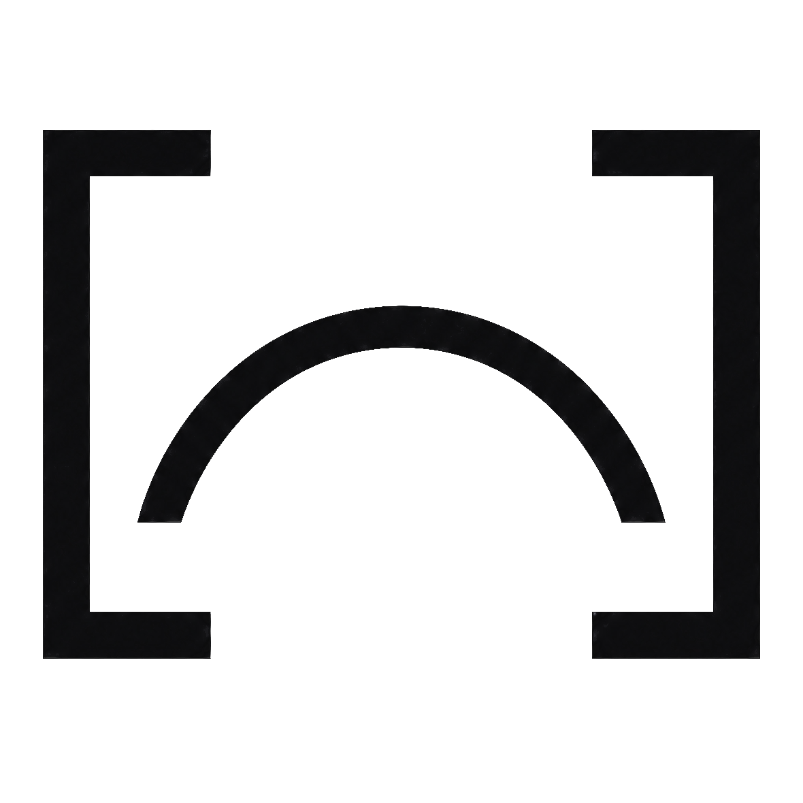
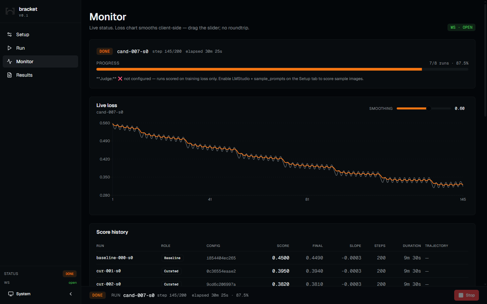
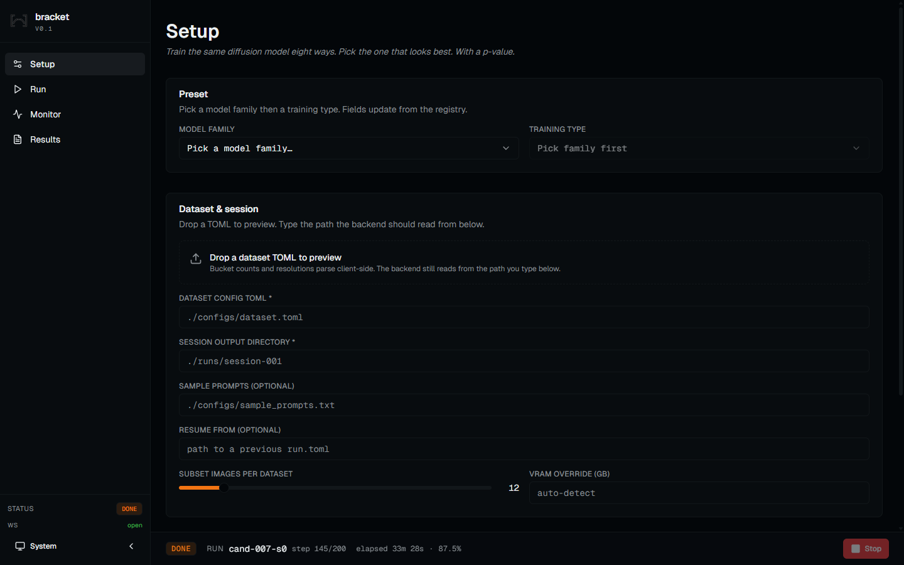
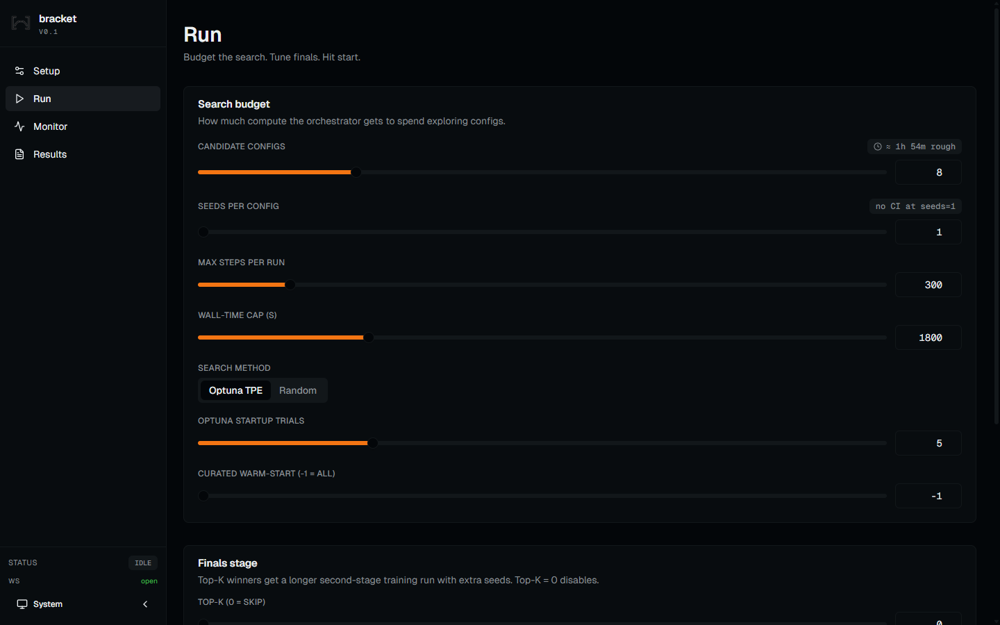
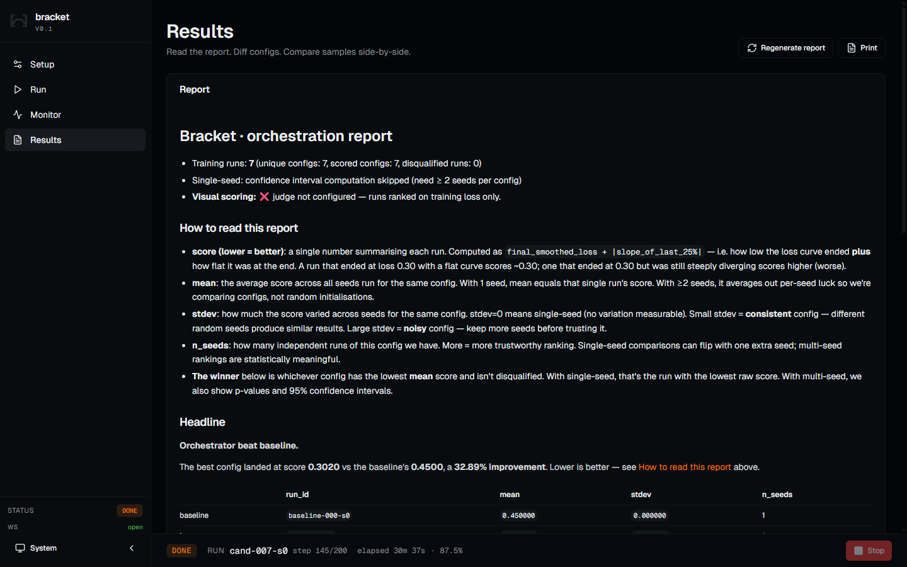

<p align="center">
  <picture>
    <source media="(prefers-color-scheme: dark)" srcset="./assets/logo-dark.png">
    
  </picture>
</p>

<h1 align="center">bracket</h1>

<p align="center"><em>Train the same diffusion model eight ways. Pick the one that looks best. With a p-value.</em></p>

<p align="center">
  
  
  
  
</p>



## What it is

bracket is a single-machine hyperparameter-search and ranking tool for diffusion-model fine-tunes. You point it at a dataset and a base model, set a budget, and it runs the same fine-tune at many configurations on a subset of your data, has a vision model rate the generated samples, and reports which config wins — with confidence intervals.

It drives the trainers you already use through real `accelerate launch` subprocesses. It does not re-implement training.

- Trainers: SDXL (LoRA + full FT), Z-Image base / Turbo (LoRA + full FT), Flux-2-Klein 9B (LoRA), and LTX-2 video (T2V + I2V LoRA) via the native Lightricks `ltx-trainer`.
- Search: Optuna TPE with curated warm-start, or Random. User-set `lr_min/max` and `batch_size_min/max` bounds clamp every run in the session — baseline and curated configs included, not just sampled trials.
- Judge: local LMStudio + Qwen3-VL by default. Hot-swappable.
- Stats: Welch's t-test on best vs runner-up. Honest about single-seed results.
- Pre-flight: dataset validation (caption coverage, empty captions, missing image dirs) catches the obvious-but-easy-to-miss problems before a single GPU second is spent. Existing latent caches are detected and re-used via sd-scripts' `--skip_cache_check`.

### Supported trainers

| Model · mode | Notes |
|---|---|
| SDXL · LoRA + full FT | sd-scripts backend. |
| Z-Image (base / Turbo) · LoRA + full FT | musubi-tuner backend. |
| Flux-2-Klein 9B · LoRA | musubi-tuner backend. |
| FLUX.2-dev · LoRA | musubi-tuner backend (requires updated musubi-tuner). Full FLUX.2 (~32B), Mistral-3 text encoder; distinct from the distilled Klein 9B row. |
| HiDream-O1 · LoRA | musubi-tuner backend (requires updated musubi-tuner). Single-file checkpoint; tokenizer/TE auto-load from HF. |
| HunyuanVideo 1.5 · LoRA | musubi-tuner backend (requires updated musubi-tuner). Qwen2.5-VL TE + ByT5 glyph encoder; T2V. |
| Kandinsky 5 · LoRA | musubi-tuner backend (requires updated musubi-tuner). Dual TE (Qwen2.5-VL + CLIP-L). |
| Ideogram 4 · LoRA | musubi-tuner backend. Text-to-image; FP8-only DiT, Flux2 VAE + Qwen3-VL-8B TE. Experimental upstream. |
| Krea 2 · LoRA | musubi-tuner backend. Text-to-image MMDiT; train on RAW, infer on Turbo. Reuses Qwen-Image VAE + Qwen3-VL-4B TE. |
| LTX-2 · T2V LoRA | Native Lightricks `ltx-trainer` backend (YAML-config driven, Gemma text encoder, joint audio-video). |
| LTX-2 · I2V LoRA | Native Lightricks `ltx-trainer` backend (YAML-config driven, Gemma text encoder, joint audio-video). |

LTX-2 full fine-tune is out of scope (needs 4-8× H100 + FSDP).

ai-toolkit ([ostris/ai-toolkit](https://github.com/ostris/ai-toolkit)) is now a supported backend, vendored under `vendor/ai-toolkit` with its own pip/venv environment; ai-toolkit-backed model presets are landing via the new backend.

No cloud. No paid tier. No telemetry.

## Who it's for

- Practitioners who keep losing eight hours to a 40k-step fine-tune that ended with flat loss and bad samples, and want to know in two hours whether their LR was wrong, their warmup was wrong, or the dataset is the issue.
- Researchers running ablations across `(model, dataset, optimizer)` triples and tired of writing one-off bash scripts that don't compose.
- LoRA authors who want a defensible "best config" with a p-value attached, not a Discord vibe-check.

## Who it's not for

- Multi-node distributed training — bracket runs sequential trials on one box.
- Hosted / managed training — runs on your hardware, your data, your weights.

## Quick start

```bash
git clone https://github.com/tlennon-ie/bracket.git
cd bracket
./install.sh        # macOS / Linux / WSL2
# or
.\install.ps1       # Windows PowerShell
# or
install.bat         # Windows cmd.exe
```

The installer detects your GPU (`nvidia-smi` → CUDA wheel match), creates `.venv/`, installs bracket editable, clones `musubi-tuner` and `sd-scripts` into `~/.cache/bracket/trainers/`, and writes a `.env` with sensible defaults. Re-running is idempotent.

```bash
./launch.sh         # serves http://127.0.0.1:8000
```

That single command starts a FastAPI server with the React frontend mounted on the same port. No separate UI process, no cloud.

## How it works

```
                       ┌─────────────────────────┐
                       │   bracket orchestrate   │
                       │   stage 1 (short runs)  │
                       └────────────┬────────────┘
   baseline  (your hand-tuned config)│
                     ↓               │
   curated  (per-trainer warm-start)─┤
                     ↓               │
   search   (Optuna TPE / random)────┤   knobs ───→ trainer
                                     │   trainer ─→ samples + tfevents
                                     │   samples ─→ VLM judge
                                     ↓
                       ┌─────────────────────────┐
                       │   Top-K finalists →     │
                       │   longer-run finals     │
                       └────────────┬────────────┘
                                    ↓
                       ┌─────────────────────────┐
                       │   Markdown report:      │
                       │   Welch's t · 95% CI    │
                       └─────────────────────────┘
```

Five stages: baseline, curated warm-start, TPE search, finals re-rank, report. Every trial writes its own `logs/stdout.log` and tfevents under `runs/<session>/runs/<run_id>/`. Resume is automatic — re-running with the same `--output-dir` continues where the ledger left off.

## The dashboard

| | |
|---|---|
|  | **Setup** — cascading model picker, dataset TOML drop with bucket preview, judge config. |
|  | **Run** — budget the search, tune finals, see a wall-time estimate before you start. |
|  | **Monitor** — live loss chart smoothed client-side (drag the slider; no roundtrip), score history, gallery. |
|  | **Results** — markdown report with the verdict, ledger table, comparison mode for sample images, and a per-run loss-curve overlay that opens when you check rows in the ledger (1-3 runs, colour-coded, client-side smoothed). |

Tab transitions are 200ms. The Monitor's loss chart updates over WebSocket — no five-second poll lag. The smoothing slider recomputes EMA in JS from a raw buffer. Keyboard shortcuts: `r` refresh · `Esc` stop · `[` `]` cycle smoothing · `g s/r/m/o` chord nav.

## Architecture in one screen

| Concern | Single source of truth |
|---|---|
| Trainer adapters (SDXL, Z-Image, Flux-2-Klein, LTX-2) | [`bracket/trainer/`](./bracket/trainer/) |
| Hyperparameter search controllers | [`bracket/search/`](./bracket/search/) |
| Run launcher (subprocess + tfevents) | [`bracket/orchestrator/runner.py`](./bracket/orchestrator/runner.py) |
| Scoring (loss + VLM) | [`bracket/orchestrator/scorer.py`](./bracket/orchestrator/scorer.py) |
| Orchestration loop | [`bracket/orchestrator/loop.py`](./bracket/orchestrator/loop.py) |
| VLM judge protocol + LMStudio impl | [`bracket/judge/`](./bracket/judge/) |
| Markdown report | [`bracket/proof/report.py`](./bracket/proof/report.py) |
| Model + training-type registry | [`bracket/registry.py`](./bracket/registry.py) |
| FastAPI server (HTTP + WebSocket + static SPA) | [`bracket/api/`](./bracket/api/) |
| React frontend (Vite + shadcn/ui) | [`frontend/`](./frontend/) |

Every concern has exactly one canonical module. Adding a new trainer is ~150 lines: implement the `Trainer` protocol and register a preset.

## Configuration

Settings live in `.env`. The installer writes one for you. Override anything by editing the file or exporting in your shell.

- `BRACKET_TRAINERS_ROOT` — where the installer cloned the trainers (default `~/.cache/bracket/trainers/`).
- `BRACKET_VENV_PYTHON` — python from the trainer venv that bracket invokes as a subprocess.
- `BRACKET_MUSUBI_DIR`, `BRACKET_SD_SCRIPTS_DIR` — clone roots for each trainer.
- `BRACKET_VAE_PATH`, `BRACKET_QWEN3_TE_PATH`, `BRACKET_FLUX2_DIT_PATH`, `BRACKET_MISTRAL3_TE_PATH` — checkpoint defaults shown in the UI. Empty by default; the user fills them in via Setup.
- `BRACKET_CORS_ORIGINS` — comma-separated allowlist for the dev server. Production serves the SPA same-origin so this is unused.

There are no hardcoded paths in the package. The installer is the only place that materialises a default location.

## Why bracket and not…

- **Optuna alone.** Optuna doesn't know what a diffusion sample is. It will minimise your training loss happily while your samples melt. bracket uses Optuna *underneath* and adds the visual signal Optuna lacks.
- **W&B Sweeps.** Same blind spot, plus a paywall and a remote dashboard for what should be a local tool. bracket emits all artifacts to a directory you already have.
- **Hand-running sd-scripts / musubi-tuner.** That's exactly what bracket replaces — and it doesn't replace the trainers themselves, it drives them.
- **AI-Toolkit.** AI-Toolkit is a unified *trainer* with a UI. bracket is a *search* on top of the trainers AI-Toolkit also drives.
- **Civitai's online trainer.** A black box on someone else's GPU. bracket runs on your hardware, your data never leaves the box, you can read the source.

## FAQ

**Why a budget instead of running until convergence?**
Diffusion fine-tunes don't have a clean convergence criterion — loss curves are noisy and the right answer is usually visible by step 200-500 if it's going to be visible at all. bracket runs short trials, ranks them, then promotes the top-K to longer runs. You get a verdict in hours, not days.

**Does the visual judge replace the loss?**
No. Default scoring is `0.3 * loss + 0.7 * sample_score`. Loss catches divergence cheaply; the VLM catches "loss is fine but the samples melted". You can move the dial all the way either direction.

**Do I need an Nvidia GPU?**
For training: yes — the trainers bracket drives need CUDA. For the bracket process itself: no — it's a Python orchestrator, not a GPU consumer. The installer installs a CPU-only PyTorch wheel into the trainer venv if it doesn't see `nvidia-smi` and warns that training will be slow.

**Does my data get sent anywhere?**
No. The judge runs locally via LMStudio. Training subprocesses write to your filesystem. Bracket has no telemetry, no opt-out flag, no analytics endpoint to disable.

**Why is the Monitor's loss curve smoothing so smooth?**
It's TensorBoard-style EMA computed in the browser from a raw points buffer. Drag the slider — it recomputes at 60 fps with no backend roundtrip.

**How does it pick the "best" run?**
Lowest mean score (lower is better) across all seeds for that config, with the disqualified set excluded. With ≥2 seeds-per-config it also reports a Welch's t-test p-value vs runner-up and a 95% CI vs baseline. With a single seed the report says so explicitly.

**Can I run it headless?**
Yes. `bracket --trainer zimage-full --dataset-toml ./configs/x.toml --budget 8 ...`. Same orchestrator under the hood as the UI.

**Why "bracket"?**
Photographers bracket exposures. Tournament brackets pick a winner. Both fit what this tool does.

## Working with an AI coding agent

Drop the repo into Cursor / Claude Code / Aider. The repo ships with `CLAUDE.md` (architecture-as-table for agents) and `.claude/skills/` (four named skills covering install, run, debug, and adding a trainer). Every operation an agent might need is documented there with concrete commands and file paths.

```
.claude/skills/
├── bracket-quickstart/SKILL.md
├── bracket-run-session/SKILL.md
├── bracket-debug-run/SKILL.md
└── bracket-add-trainer/SKILL.md
```

## Roadmap

Honest, scoped, and shippable. See [`docs/ROADMAP.md`](./docs/ROADMAP.md) for the full list — highlights:

- v0.2 — per-step VLM scoring, true ASHA, comparison mode polish.
- v0.3 — HunyuanDiT, Sana, Lumina-Next, AI-Toolkit adapter.
- v0.4 — video diffusion (Wan-2.2, HunyuanVideo).
- v0.5 — LLMs (Axolotl, torchtune, unsloth) with an `LLMJudge` for perplexity / task-eval / structured-output.

Not on the roadmap: distributed multi-node, cloud bursting, paid tiers.

## Contributing

Small fixes welcome. For larger changes (new trainer adapter, new judge backend), please open an issue first.

```bash
pytest -q                      # full suite, ~17s
cd frontend && npm run lint    # frontend, Biome
```

The agent skill at [`.claude/skills/bracket-add-trainer/SKILL.md`](./.claude/skills/bracket-add-trainer/SKILL.md) is the spec for new trainer adapters.

## License

MIT — see [LICENSE](./LICENSE).
